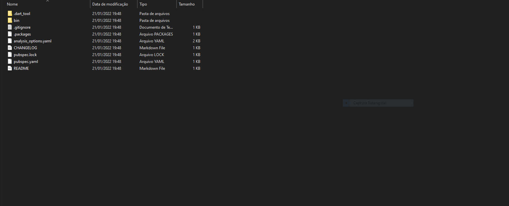
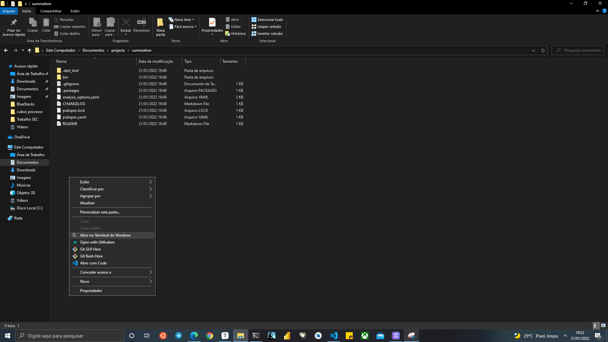
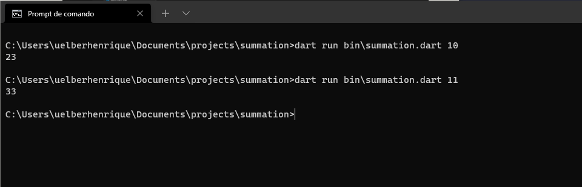
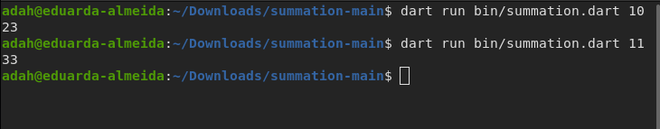

##  Seleção de Desenvolvedor de Software - Escribo

#### Teste Técnico

 #### 1. Irá abrir a pasta do projeto
 
   
     
 #### 2. Vai abrir o terminal na pasta do projeto
 
   
     
 #### 3. Rodar o projeto com o comando
   ## Comando no Windows:
    
   Primeiro caso de Teste: 
    
       dart run bin\summation.dart 10
 
   Segundo caso de Teste:
   
       dart run bin\summation.dart 11

    
   ## Comando no Linux:

   Primeiro caso de Teste: 

       dart run bin/summation.dart 10

   Segundo caso de Teste:

       dart run bin/summation.dart 11

    

   ## Resultado 
   Windows:
   
   
    
   
   Linux:
   
   
    
   

    
